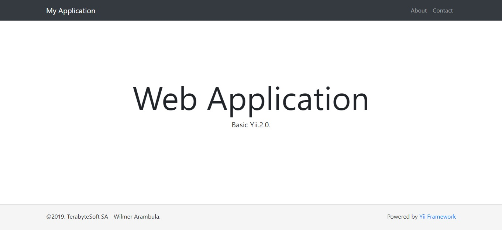

<p align="center">
    <a href="https://github.com/terabytesoft/app-basic" target="_blank">
        
    </a>
    <h1 align="center">Web Application Basic</h1>
</p>

<p align="center">
    <a href="https://packagist.org/packages/terabytesoftw/app-basic" target="_blank">
        
    </a>
    <a href="https://travis-ci.org/terabytesoftw/app-basic" target="_blank">
        
    </a>
    <a href="https://scrutinizer-ci.com/g/terabytesoftw/app-basic/" target="_blank">
        
    </a>
    <a href="https://scrutinizer-ci.com/g/terabytesoftw/app-basic/?branch=master" target="_blank">
     	
    </a>
    <a href="https://scrutinizer-ci.com/code-intelligence" target="_blank">
     	
    </a>
    <a href="https://codeclimate.com/github/terabytesoftw/app-basic/maintainability" target="_blank">
        
    </a>
	<a href="https://github.styleci.io/repos/165419144">
		
	</a>		
</p>
</br>

<p align="center">
App Web Application Basic of Yii Version 2.0. <a href="http://www.yiiframework.com/" title="Yii Framework" target="_blank">Yii Framework</a> application best for rapidly creating projects with Bootstrap 4.
</p>

</br>



</br>

### **DIRECTORY STRUCTURE:**

```
config/             contains application configurations
docs/               contains documentation application basic
src/
  assets/           contains assets definition
  controllers/      contains controller class
  forms/            contains forms class
  messages/         contains messages translate application 
  views/            contains views files for web application
tests/              contains tests codeception for the web application
vendor/             contains dependent 3rd-party packages
```

### **FEATURES:**

The App Web Application contains:

- [x] Pages - [Screenshots]:
    - [about](docs/images/about.jpg)
    - [contact](docs/images/contact.jpg)

<p align="justify">
It includes all commonly used configurations that would allow you to focus on adding new
features to your application.
</P>

### **REQUIREMENTS:**

- The minimum requirement by this project template that your Web server supports:
    - PHP 7.2 or higher.
    - NPM [Installation](https://nodejs.org/en/download/)

### **INSTALLATION:**

<p align="justify">
If you do not have <a href="http://getcomposer.org/" title="Composer" target="_blank">Composer</a>, you may install it by following the instructions at <a href="http://getcomposer.org/doc/00-intro.md#installation-nix" title="getcomposer.org" target="_blank">getcomposer.org</a>.
</p>

You can then install this project template using the following command:

~~~
composer create-project --prefer-dist --stability=dev terabytesoft/app-template-basic myapp
~~~

<p align="justify">
Now you should be able to access the application through the following URL, assuming `public` is the directory
directly under the Web root.
</p>

<p align="justify">
<strong>App Web Application Basic (terabytesoft/app-basic) is installed automatically together with the Web Project Skeleton Application Basic (terabytesoft/app-template-basic), both try the necessary packages to start your Web Application Basic in Yii3.</strong>
</p>

__*Virtual Host:*__

~~~
http://localhost/
~~~

__*Server Yii:*__

Directory - / [app-template-basic]

~~~
 ./vendor/bin/yii serve
~~~

### **CONFIGURATION:**

- [Detailed Settings](docs/Config.MD).

**NOTE:** 

<p align="justify">
All the configuration is customizable through parameters, there is no need to modify any configuration of Yii 3.0 Web Application Basic, if you need any extra configuration you can open an issue with pleasure we will add it.
</p>

Very important when changing any configuration run `composer du`, to apply it.

### **GENERATE MESSAGES TRANSLATION:**

<p align="justify">
To generate the Yii 3.0 Web Application Basic translations, you can change the language settings in:
<p>

```
config/messages.php - [app-template-basic]:

'languages' => ['en'], 
```
<p align="justify">
 Automatically the generator will create the folder of your language in /messages - [app-template-basic], If any translation is needed, you can open an issue to add it.
</p>

```
root directory - [app-template-basic]:
 ./vendor/bin/yii message config/messages.php
```

### **RUN TESTS CODECEPTION:**

~~~
$ cd vendor/terabytesoft/app-basic
$ composer update --prefer-dist -vvv
$ php -S 127.0.0.1:8080 -t tests/public > /dev/null 2>&1&
$ vendor/bin/codecept run
~~~

### **WEB SERVER SUPPORT:**

- Apache.
- Nginx.
- OpenLiteSpeed.

### **DOCUMENTATION STYLE GUIDE:**

[Style CI Documentation PSR2.](https://docs.styleci.io/presets#psr2)

### **LICENCE:**

[](LICENSE.md)
[](https://www.yiiframework.com/)
[](https://packagist.org/packages/terabytesoft/app-basic)
