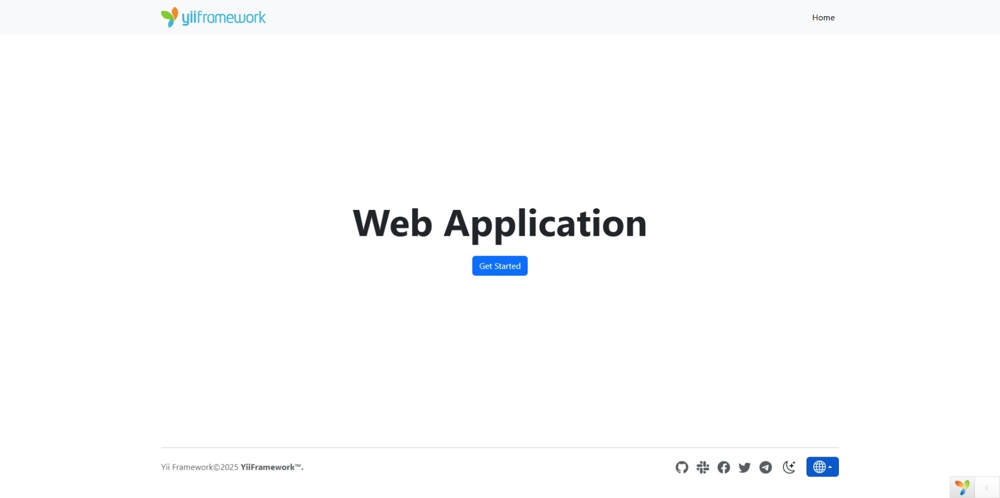

<p align="center">
    <a href="https://github.com/yii2-extensions/app-basic" target="_blank">
        
    </a>
    <h1 align="center">Web Application Basic</h1>
</p>

<p align="center">
    <a href="https://packagist.org/packages/yii2-extensions/app-basic" target="_blank">
        
    </a>
    <a href="https://packagist.org/packages/yii2-extensions/app-basic" target="_blank">
        
    </a>    
    <a href="https://www.php.net/releases/8.1/en.php" target="_blank">
        
    </a>
    <a href="https://github.com/yiisoft/yii2/tree/2.0.53" target="_blank">
        
    </a>
    <a href="https://github.com/yiisoft/yii2/tree/22.0" target="_blank">
        
    </a>
    <a href="https://github.com/yii2-extensions/app-basic/actions/workflows/build.yml" target="_blank">
        
    </a>
    <a href="https://github.com/yii2-extensions/app-basic/actions/workflows/static.yml" target="_blank">
        
    </a>
</p>

A modern, Bootstrap 5-powered Yii2 application template designed for rapid web-application development. Built with best practices, clean architecture, and developer-friendly configuration, it lets you create production-ready apps with minimal setup while maintaining code quality and extensibility.

<picture>
    <source media="(prefers-color-scheme: dark)" srcset="docs/images/home-dark.png">
    <source media="(prefers-color-scheme: light)" srcset="docs/images/home.png">
    
</picture>

## Features

- ✅ **Asset Management** - Optimized asset bundles for CSS, JS, and resource management.
- ✅ **Clean Architecture** - Well-organized directory structure following Yii2 best practices.
- ✅ **Console Commands** - Example console commands for background tasks and maintenance.
- ✅ **Developer Tools** - Debugging tools, logging, and development-friendly configurations.
- ✅ **Modern Bootstrap 5 UI** - Responsive, mobile-first design with latest Bootstrap components.
- ✅ **Testing Ready** - Codeception test suite with examples for functional and unit testing.

## Available stacks

[](https://github.com/yii2-extensions/app-basic/tree/franken-php)
[](https://github.com/yii2-extensions/app-basic/tree/road-runner)

For setup instructions, see README in each branch.

## How it works

The Yii2 Web Application Basic template provides a complete foundation for building modern web applications. Unlike starting from scratch, this template includes.

1. **Pre-configured structure** with organized directories for assets, views, models, and controllers.
2. **Bootstrap 5 integration** for responsive, mobile-first user interfaces.
3. **Security features** including CSRF protection and input validation.
4. **Development tools** for debugging, logging, and testing.

**Why use this template**

- **Rapid development**: Start building features immediately without setup overhead.
- **Best practices**: Follow Yii2 conventions and modern web development standards.
- **Extensible**: Easy to customize and extend for specific project requirements.
- **Production-ready**: Includes security features and optimizations for deployment.

>Note: Also, make sure to install [`npm`](https://nodejs.org/en/download/) for frontend dependency management.

### Installation

```bash
composer create-project --prefer-dist yii2-extensions/app-basic app-basic:^0.1
cd app-basic
```

### Quick start

Start development server

```bash
# Using built-in PHP server
php -S localhost:8080 -t web

# Or using Yii console command
./yii serve
```

> Your application will be available at `http://localhost:8080` or at the address set in `--address` option.

### Basic usage

#### Directory structure

```text
root/
├── config/                Configuration files
│   ├── common/            Common configuration
│   ├── console/           Console configuration  
│   ├── web/               Web configuration
│   └── messages.php       Translation config
├── src/
│   ├── framework/         Framework assets & resources
│   │   ├── asset/         Asset bundles
│   │   └── resource/      CSS, JS, layouts, messages
│   └── usecase/           Application use cases
│       ├── hello/         Console command example
│       └── site/          Site pages
├── tests/                 Test suites
├── vendor/                Composer dependencies
└── web/                   Web server document root
```

#### Creating your first page

```php
<?php
// src/usecase/site/SiteController.php

declare(strict_types=1);

namespace app\usecase\site;

use yii\web\Controller;

final class SiteController extends Controller
{
    public function actionIndex(): string
    {
        return $this->render('index');
    }
}
```

#### Console commands

```bash
# Run the hello command
./yii hello/index

# Generate translations
./yii message config/messages.php

# Clear cache
./yii cache/flush-all
```
## Quality code

[](https://codecov.io/github/yii2-extensions/app-basic)
[](https://github.com/yii2-extensions/app-basic/actions/workflows/static.yml)
[](https://github.styleci.io/repos/165419144?branch=main)

## Documentation

For detailed configuration options and advanced usage:

- 📚 [Installation Guide](docs/installation.md)
- ⚙️ [Configuration Reference](docs/configuration.md) 
- 🧪 [Testing Guide](docs/testing.md)
- 📸 [Screenshots](docs/screenshots.md)

## Our social networks

[](https://x.com/Terabytesoftw)

## License

[](LICENSE.md)
