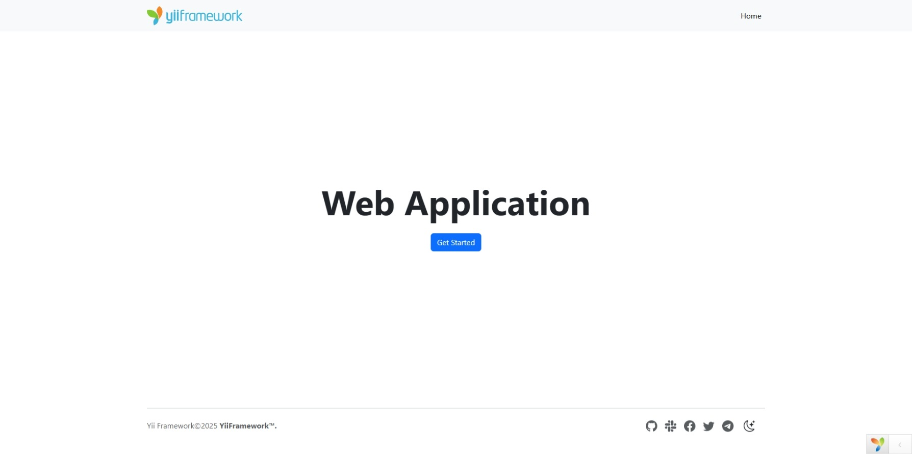

<!-- markdownlint-disable MD041 -->
<p align="center">
    <picture>
        <source media="(prefers-color-scheme: dark)" srcset="https://www.yiiframework.com/image/design/logo/yii3_full_for_dark.svg">
        <source media="(prefers-color-scheme: light)" srcset="https://www.yiiframework.com/image/design/logo/yii3_full_for_light.svg">
        
    </picture>
    <h1 align="center">Web Application Basic</h1>
    <br>
</p>
<!-- markdownlint-enable MD041 -->

<p align="center">
    <a href="https://github.com/yii2-extensions/app-basic/actions/workflows/build.yml?query=branch%3Afranken-php" target="_blank">
        
    </a>
    <a href="https://github.com/yii2-extensions/app-basic/actions/workflows/static.yml?query=branch%3Afranken-php" target="_blank">
        
    </a>
</p>

<p align="center">
    <strong>A modern, Bootstrap 5-powered Yii2 application template for rapid development</strong><br>
    <em>Clean architecture, production-ready features, and developer-friendly configuration</em>
</p>

<picture>
    <source media="(prefers-color-scheme: dark)" srcset="docs/images/home-dark.png">
    <source media="(prefers-color-scheme: light)" srcset="docs/images/home.png">
    
</picture>

## Features

<picture>
    <source media="(min-width: 768px)" srcset="./docs/svgs/features.svg">
    
</picture>

## How it works

The Yii2 Web Application Basic template provides a complete foundation for building modern web applications. Unlike starting
from scratch, this template includes.

1. **Pre-configured structure** with organized directories for assets, views, models, and controllers.
2. **Bootstrap 5 integration** for responsive, mobile-first user interfaces.
3. **Security features** including CSRF protection and input validation.
4. **Development tools** for debugging, logging, and testing.

**Why use this template**

- **Rapid development**: Start building features immediately without setup overhead.
- **Best practices**: Follow Yii2 conventions and modern web development standards.
- **Extensible**: Easy to customize and extend for specific project requirements.
- **Production-ready**: Includes security features and optimizations for deployment.

> [!NOTE]
> Also, make sure to install [`npm`](https://nodejs.org/en/download/) for frontend dependency management.

### Installation

```bash
composer create-project --prefer-dist yii2-extensions/app-basic:dev-franken-php app-basic
cd app-basic
```

### Quick start

Download static cli in Linux/WSL2

```bash
curl https://frankenphp.dev/install.sh | sh
```

Start the server in CLI mode

```bash
./frankenphp run --config ./Caddyfile --watch
```

Download and start the server with [Docker images](https://frankenphp.dev/docs/docker/)

Gitbash/Windows

<!-- editorconfig-checker-disable -->
<!-- prettier-ignore-start -->
```bash
docker run \
  -e CADDY_GLOBAL_OPTIONS="auto_https off" \
  -e CADDY_SERVER_EXTRA_DIRECTIVES="tls /app/web/ssl/localhost.pem /app/web/ssl/localhost-key.pem" \
  -e FRANKENPHP_CONFIG="worker ./web/index.php" \
  -e SERVER_NAME="https://localhost:8443" \
  -e SERVER_ROOT="./web" \
  -v "//k/yii2-extensions/app-basic:/app" \
  -p 8443:8443 \
  -p 8443:8443/udp \
  --name yii2-frankenphp-worker \
  dunglas/frankenphp
```
<!-- prettier-ignore-end -->
<!-- editorconfig-checker-enable -->

> **Note:** Paths in the example (`//k/yii2-extensions/app-basic`) are for demonstration purposes only.  
> Replace them with the actual path to your Yii2 project on your system.

Linux/WSL

<!-- editorconfig-checker-disable -->
<!-- prettier-ignore-start -->
```bash
docker run \
  -e CADDY_GLOBAL_OPTIONS="auto_https off" \
  -e CADDY_SERVER_EXTRA_DIRECTIVES="tls /app/web/ssl/localhost.pem /app/web/ssl/localhost-key.pem" \
  -e FRANKENPHP_CONFIG="worker ./web/index.php" \
  -e SERVER_NAME="https://localhost:8443" \
  -e SERVER_ROOT="./web" \
  -v $PWD:/app \
  -p 8443:8443 \
  -p 8443:8443/udp \
  --name yii2-frankenphp-worker \
  dunglas/frankenphp
```
<!-- prettier-ignore-end -->
<!-- editorconfig-checker-enable -->

> [!IMPORTANT]
> Your application will be available at `https://localhost:8443` or at the address set in the `Caddyfile`.

#### Directory structure

```text
root/
├── config/                Configuration files
│   ├── common/            Common configuration
│   ├── console/           Console configuration
│   ├── web/               Web configuration
│   └── messages.php       Translation config
├── src/
│   ├── framework/         Framework assets & resources
│   │   ├── asset/         Asset bundles
│   │   └── resource/      CSS, JS, layouts, messages
│   └── usecase/           Application use cases
│       ├── hello/         Console command example
│       └── site/          Site pages
├── tests/                 Test suites
├── vendor/                Composer dependencies
└── web/                   Web server document root
```

#### Creating your first page

```php
<?php
// src/usecase/site/SiteController.php

declare(strict_types=1);

namespace app\usecase\site;

use yii\web\Controller;

final class SiteController extends Controller
{
    public function actionIndex(): string
    {
        return $this->render('index');
    }
}
```

#### Console commands

```bash
# Run the hello command
./yii hello/index

# Generate translations
./yii message config/messages.php

# Clear cache
./yii cache/flush-all
```

## Package information

[](https://www.php.net/releases/8.1/en.php)
[](https://github.com/yiisoft/yii2/tree/2.0.53)
[](https://github.com/yiisoft/yii2/tree/22.0)
[](https://packagist.org/packages/yii2-extensions/franken-php)

## Quality code

[](https://codecov.io/github/yii2-extensions/app-basic)
[](https://github.com/yii2-extensions/app-basic/actions/workflows/static.yml?query=branch%3Afranken-php)
[](https://github.com/yii2-extensions/app-basic/actions/workflows/linter.yml?query=branch%3Afranken-php)
[](https://github.styleci.io/repos/165419144?branch=franken-php)

## Documentation

For detailed configuration options and advanced usage:

- 📚 [Installation Guide](docs/installation.md)
- ⚙️ [Configuration Reference](docs/configuration.md)
- 🧪 [Testing Guide](docs/testing.md)
- 📸 [Screenshots](docs/screenshots.md)

## Our social networks

[](https://x.com/Terabytesoftw)

## License

[](LICENSE)
