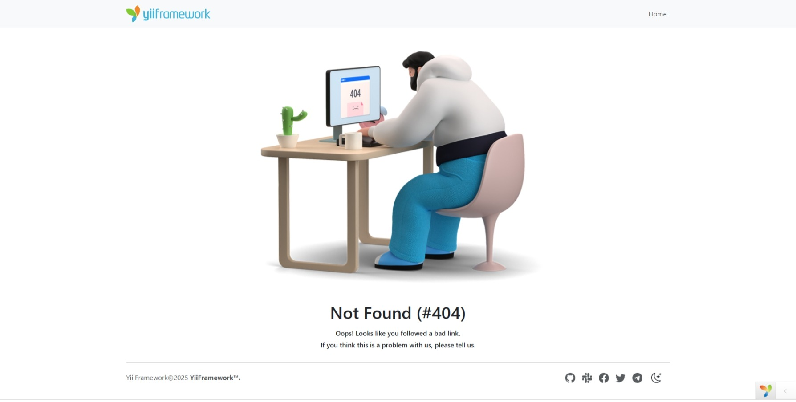

# Screenshots

## Home page

<picture>
    <source media="(prefers-color-scheme: dark)" srcset="images/home-dark.png">
    <source media="(prefers-color-scheme: light)" srcset="images/home.png">
    
</picture>

## Error page

<picture>
    <source media="(prefers-color-scheme: dark)" srcset="images/404-dark.png">
    <source media="(prefers-color-scheme: light)" srcset="images/404.png">
    
</picture>
